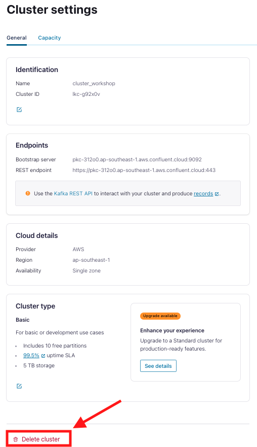

## Log into Confluent Cloud

1. Log into [Confluent Cloud](https://confluent.cloud) and enter your email and password.

    

2. If you are logging in for the first time, you will see a self-guided wizard that walks you through spinning up a cluster. Please minimize this as you will walk through those steps in this workshop. 

***

## Create an Environment and Cluster

An environment contains clusters and its deployed components such as Apache Flink, Connectors, ksqlDB, and Schema Registry. You have the ability to create different environments based on your company's requirements. For example, you can use environments to separate Development/Testing, Pre-Production, and Production clusters. 

1. Click **+ Add Environment**. Specify an **Environment Name** and Click **Create**. 

>**Note:** There is a *default* environment ready in your account upon account creation. You can use this *default* environment for the purpose of this workshop if you do not wish to create an additional environment.

    

2. Now that you have an environment, click **Create Cluster**. 

> **Note:** Confluent Cloud clusters are available in 5 types: Basic, Standard, Enterprise, Dedicated and Freight. Basic is intended for development use cases so you can use that for the workshop. Basic clusters only support single zone availability. Standard and Dedicated clusters are intended for production use and support Multi-zone deployments. If you are interested in learning more about the different types of clusters and their associated features and limits, refer to this [documentation](https://docs.confluent.io/current/cloud/clusters/cluster-types.html).

3. Chose the **Basic** cluster type. 

    

4. Click **Begin Configuration**. 
5. Choose your preferred Cloud Provider (AWS, GCP, or Azure), region, and availability zone. 
6. Specify a **Cluster Name**. For the purpose of this lab, any name will work here. 

    

7. View the associated *Configuration & Cost*, *Usage Limits*, and *Uptime SLA* information before launching. 
8. Click **Launch Cluster**. 

***

## Creates Topics

1. On the navigation menu, you will see **Cluster Overview**. 

> **Note:** This section shows Cluster Metrics, such as Throughput and Storage. This page also shows the number of Topics, Partitions, Connectors, and ksqlDB Applications.

2. Click on **Cluster Settings**. This is where you can find your *Cluster ID, Bootstrap Server, Cloud Details, Cluster Type,* and *Capacity Limits*.
3. On the same navigation menu, select **Topics** and click **Create Topic**. 
4. Enter **customers** as the topic name, **3** as the number of partitions, skip the data contract and then click **Create with defaults**.'

    

5. Repeat the previous step and create a second topic name **clicks** and **3** as the number of partitions and skip the data contract.

> **Note:** Topics have many configurable parameters. A complete list of those configurations for Confluent Cloud can be found [here](https://docs.confluent.io/cloud/current/topics/overview.html). If you are interested in viewing the default configurations, you can view them in the Topic Summary on the right side. 

7. After topic creation, the **Topics UI** allows you to monitor production and consumption throughput metrics and the configuration parameters for your topics. When you begin sending messages to Confluent Cloud, you will be able to view those messages and message schemas.

***

## Clean Up Resources

Deleting the resources you created during this workshop will prevent you from incurring additional charges. 

3. First, under **Cluster Settings**, select the **Delete Cluster** button at the bottom. Enter the **Cluster Name** and select **Confirm**. 

    

4. To remove all resource pertaining to this workshop, delete the environment **workshop**.

    

*** 

## Confluent Resources and Further Testing

Here are some links to check out if you are interested in further testing:
- [Confluent Cloud Documentation](https://docs.confluent.io/cloud/current/overview.html)
- [Apache Flink 101](https://developer.confluent.io/courses/apache-flink/intro/)
- [Stream Processing with Confluent Cloud for Apache Flink](https://docs.confluent.io/cloud/current/flink/index.html)
- [Flink SQL Reference](https://docs.confluent.io/cloud/current/flink/reference/overview.html)
- [Flink SQL Functions](https://docs.confluent.io/cloud/current/flink/reference/functions/overview.html)
- [Confluent tableflow](https://docs.confluent.io/cloud/current/topics/tableflow/overview.html)

***
