# Lab 1: Configure AWS and Enable Tableflow

**Introduction**

Getting data from real-time operational systems like Apache Kafka into formats ready for analytics often requires complex tooling and custom pipelines. Confluent Tableflow simplifies this process dramatically. It's a feature within Confluent Cloud designed to easily materialize your Kafka topic data directly into open table formats like Apache Iceberg or Delta Lake, stored in cloud object storage such as Amazon S3. This avoids the need for separate ETL jobs or custom connectors, bridging the gap between streaming data and analytical systems. Tableflow automatically handles details like schema evolution and data compaction, making your Kafka data readily available and performant for query engines like AWS Athena or Snowflake.

In this lab, you will learn how to set up the foundational components required to use Tableflow with your own AWS storage. Specifically, you will:

* Create the necessary AWS resources: an S3 bucket for storage, an IAM policy defining permissions, and an IAM role for secure access.
* Configure the secure connection (Provider Integration) between your Confluent Cloud environment and your AWS account.
* Enable Tableflow on your existing Kafka topics to begin syncing data to your S3 bucket as Iceberg tables.


This lab guides you through setting up the necessary AWS resources (S3 Bucket, IAM Policy, IAM Role), configuring the Confluent Cloud Tableflow Provider Integration, and finally, enabling Tableflow on your Kafka topics. This allows Tableflow to securely write Kafka topic data into your own S3 bucket as Apache Iceberg tables.

**Prerequisites:**

* You have some topics created and have some data into those topics.
* Access to an AWS account with permissions to create S3 buckets, IAM policies, and IAM roles.

---

## Step 1: Create an Amazon S3 Bucket

First, let's create the S3 bucket where Tableflow will store the Iceberg data.

1.  In a new browser tab, navigate to the Amazon S3 console in your AWS account.
2. Ensure you are in the same AWS region as your Confluent Kafka cluster (example: us-east-2)
2.  Click on **Create Bucket** (top right).

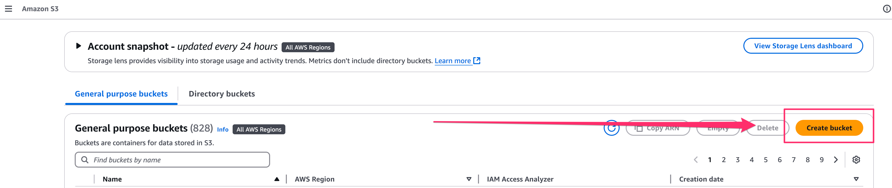

3.  Configure the bucket:
    * **Bucket name:** Choose a globally unique name.`tableflow-bucket-<<Account-ID>>`, replacing `<<Account-ID>>` with your AWS Account ID. Record this name.
    * Leave other settings as default (e.g., Block Public Access) unless you have specific requirements.

 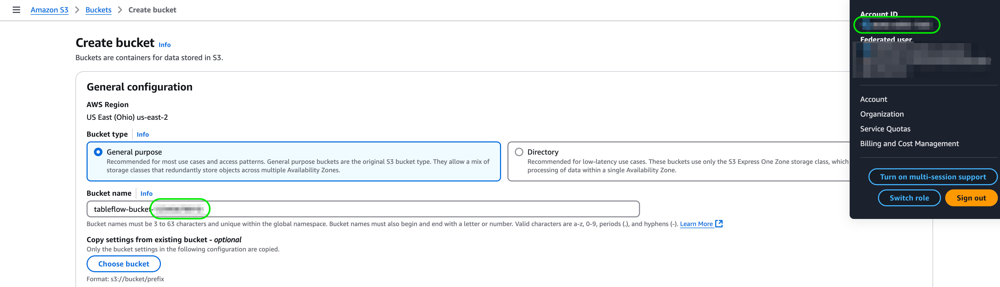  

4.  Scroll down and click **Create Bucket**.

---

## Step 2: Configure Storage Provider Integration (Confluent Cloud)

Now, let's start the process in Confluent Cloud to connect to the S3 bucket.

1.  Navigate back to your **Confluent Cloud** console.
2.  Within your Environment's Cluster, click on **Tableflow** in the left-hand menu.
3.  In the center of the Tableflow page, find the option related to storage connections and click **Go to Provider Integrations**. *(Note: UI text might vary slightly)*.
4.  Click **+ Add Integration**.
5.  Choose to **create a new role** when prompted and click **Continue**.
6.  On the "Create Permission Policy in AWS" screen, ensure **Tableflow S3 Bucket** is selected (or similar option representing S3 access).
7.  **IMPORTANT:** Confluent Cloud will display a JSON permissions policy. **Copy this `permissions-policy.json`**. You will need it in the next step to create the IAM policy in AWS. Keep this Confluent Cloud wizard page open.

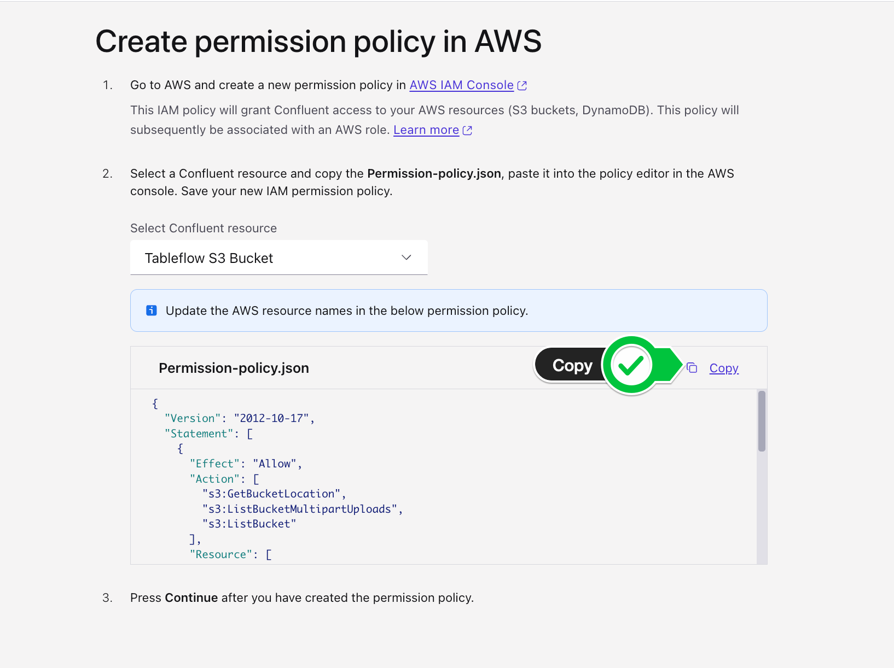

---

## Step 3: Create a New Permissions Policy on AWS

Use the policy JSON copied from Confluent Cloud to create an IAM policy in AWS that grants the necessary S3 permissions.

1.  In a new browser tab or window, go to the **IAM** service in your AWS Management Console.
2.  Click **Policies** in the left navigation pane.
3.  Click **Create Policy**.
4.  Select the **JSON** tab.
5.  Paste the `permissions-policy.json` you copied from the Confluent Cloud wizard into the JSON editor.
6.  **CRITICAL:** Find the `Resource` sections in the JSON policy and replace the placeholder bucket names (e.g., `tableflow-bucket-123456789101` in the document example) with your *actual* S3 bucket name created in Step 1 (e.g., `tableflow-bucket-<<Account-ID>>`). Make sure to update it in both places (e.g., `arn:aws:s3:::your-bucket-name` and `arn:aws:s3:::your-bucket-name/*`).

    ```json
    // Example structure from the document - ensure your bucket name is correct
    {
        "Version": "2012-10-17",
        "Statement": [
            {
                "Effect": "Allow",
                "Action": [
                    "s3:GetBucketLocation",
                    "s3:ListBucketMultipartUploads",
                    "s3:ListBucket"
                ],
                "Resource": [
                    "arn:aws:s3:::<<Your S3 Bucket Name>>" // Replace placeholder
                ]
            },
            {
                "Effect": "Allow",
                "Action": [
                    "s3:PutObject",
                    "s3:PutObjectTagging", // May differ slightly based on wizard version
                    "s3:GetObject",
                    "s3:DeleteObject",
                    "s3:AbortMultipartUpload",
                    "s3:ListMultipartUploadParts"
                ],
                "Resource": [
                    "arn:aws:s3:::<<Your S3 Bucket Name>>/*" // Replace placeholder
                ]
            }
        ]
    }
    ```

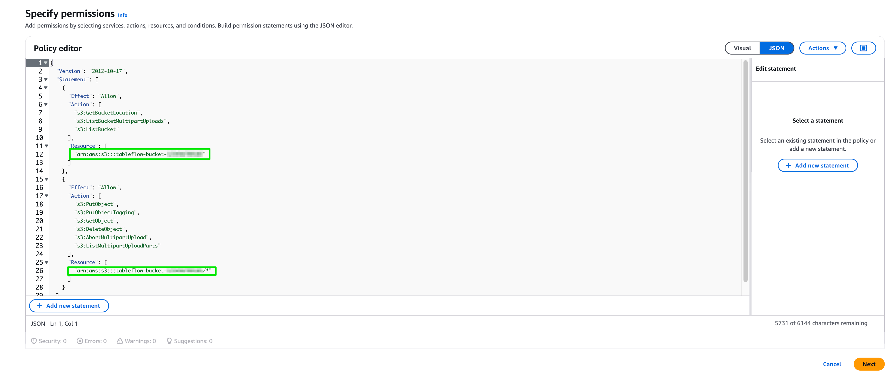

7.  Click **Next** (or Next: Tags -> Next: Review).
8.  Give the policy a descriptive **Name**, like `tableflow-s3-access-policy`.
9.  Click **Create Policy**.
10. Return to the **Confluent Cloud** provider integration wizard and click **Continue**.

---

## Step 4: Create Role in AWS and Map to Confluent (Initial Steps)

Now, create the IAM role in AWS that Confluent Cloud will assume, using a trust policy provided by Confluent.

1.  The Confluent Cloud wizard should now display a **`trust-policy.json`** on the "Create role in AWS and map to Confluent" page. **Copy this `trust-policy.json`**. Keep the Confluent wizard open.
2.  In AWS, navigate back to the **IAM** service -> **Roles**.
3.  Click **Create role**.
4.  Select **Custom trust policy** as the trusted entity type.
5.  Paste the `trust-policy.json` you copied from Confluent Cloud into the JSON editor.

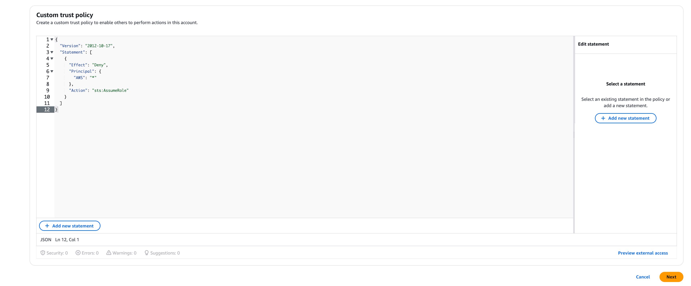

6.  Click **Next**.
7.  On the **Add permissions** page, search for and select the IAM policy you created in Step 3 (e.g., `tableflow-s3-access-policy`).
8.  Click **Next**.
9.  Enter a **Role name** (e.g., `quickstart-tableflow-assume-role`).
10. Scroll down and click **Create role**.
11. After the role is created, click **View Role** (or find it in the list and click its name).
12. **IMPORTANT:** Find and copy the **ARN** (Amazon Resource Name) of the role you just created. It will look like `arn:aws:iam::<<Your AWS Account ID>>:role/<<Your Role Name>>`.

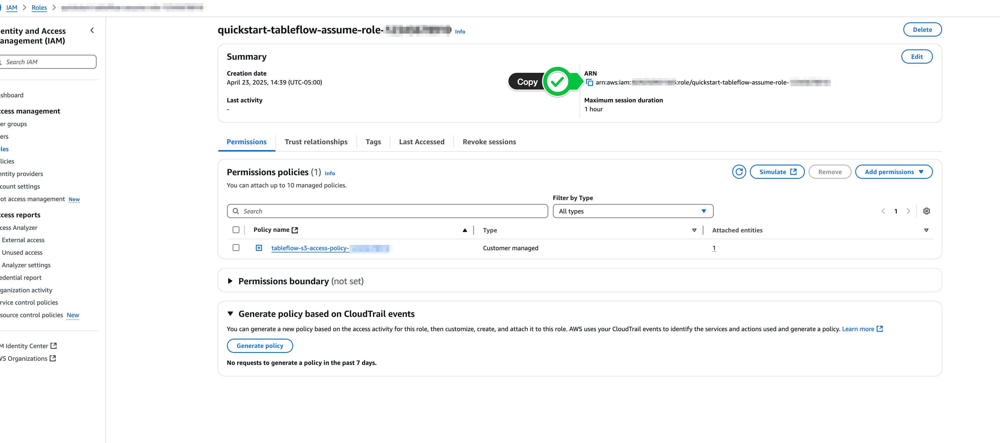


---

## Step 5: Complete Provider Integration (Confluent Cloud & AWS)

Finally, provide the Role ARN to Confluent Cloud and update the role's trust policy in AWS with the External ID from Confluent.

1.  Return to the **Confluent Cloud** Provider Integration wizard page.
2.  Paste the **AWS Role ARN** you just copied into the appropriate field ("AWS ARN " or similar).
3.  Give the Provider Integration a **Name** (e.g., `s3-provider-integration`).
4.  Click **Continue**.
5.  **IMPORTANT:** Confluent Cloud will now display an **updated Trust Policy JSON**, which includes a unique `sts:ExternalId`. **Copy this entire updated `trust-policy.json`**.

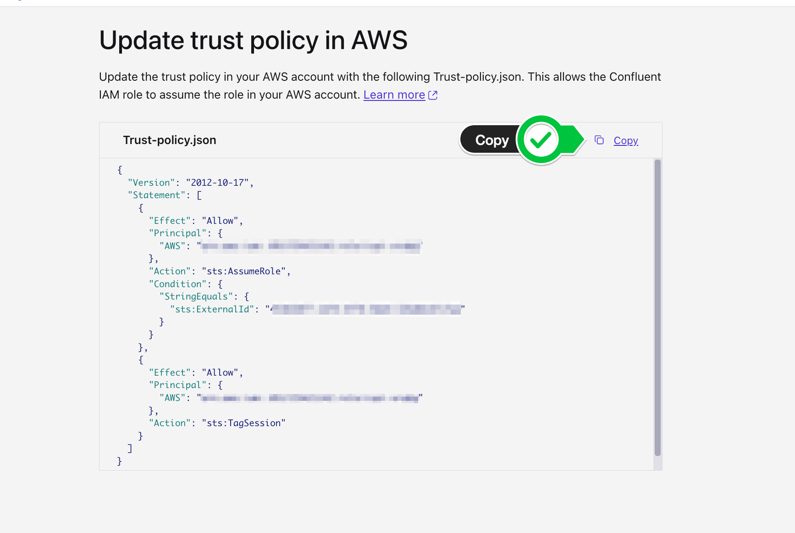

6.  Go back to the **AWS IAM Role** you created (e.g., `quickstart-tableflow-assume-role`).
7.  Select the **Trust relationships** tab.
8.  Click **Edit trust policy** (or Edit trust relationship).
9.  **Replace the entire existing JSON** with the updated `trust-policy.json` you copied from Confluent Cloud in the previous step. This adds the necessary External ID condition.
10. Click **Update policy** (or Save changes).
11. Return to the **Confluent Cloud** wizard one last time and click **Continue** (or Finish/Create).

---

## Step 6: Enable Tableflow on Your Kafka Topics

With the Provider Integration successfully configured, you can now enable Tableflow for your desired Kafka topics.

1.  **Navigate to Topics:**
    * In your Confluent Cloud console, go to your Environment, then select your Kafka Cluster.
    * In the left-hand navigation menu for your cluster, click on **Topics**. You should see a list of your topics.

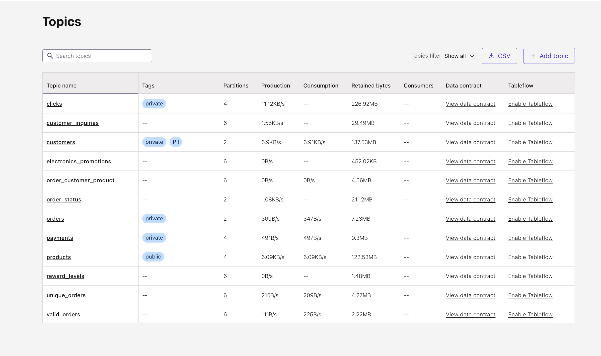

2.  **Select a Topic and Enable Tableflow:**
    * Find the specific topic you want to enable Tableflow for in the list (e.g., `clicks`, `customer_inquiries`, `orders`, etc.).
    * On the right-hand side of the row for that topic, in the "Tableflow" column, click the **Enable Tableflow** button/link.


  * ⚠️ Note: As of April 2025, Upsert Topics are not supported on Tableflow. 

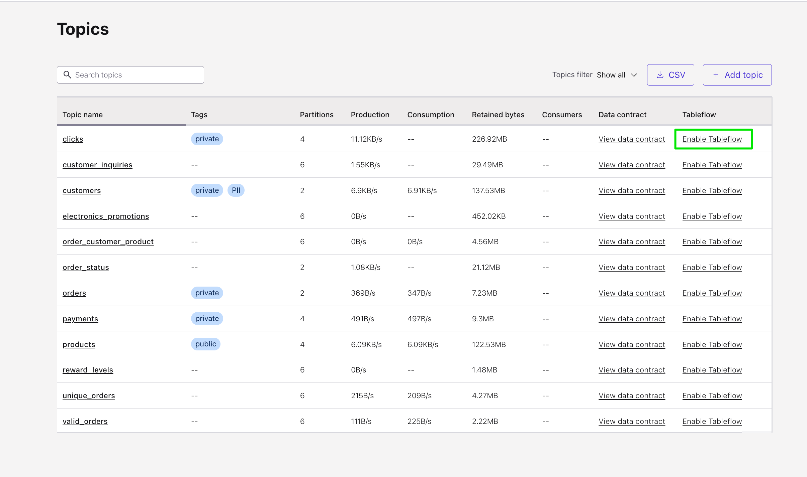

3.  **Configure Storage:**
    * You will be asked to choose storage. Select **Configure custom storage**.
    * In the next menu, choose the **Provider Integration** you just created in Steps 2-5 (e.g., `s3-provider-integration`). You can identify it by the integration name or the IAM Role ARN.
    * Enter your **AWS S3 bucket name** (e.g., `tableflow-bucket-<<account-id>>`) where the Iceberg data should be written.

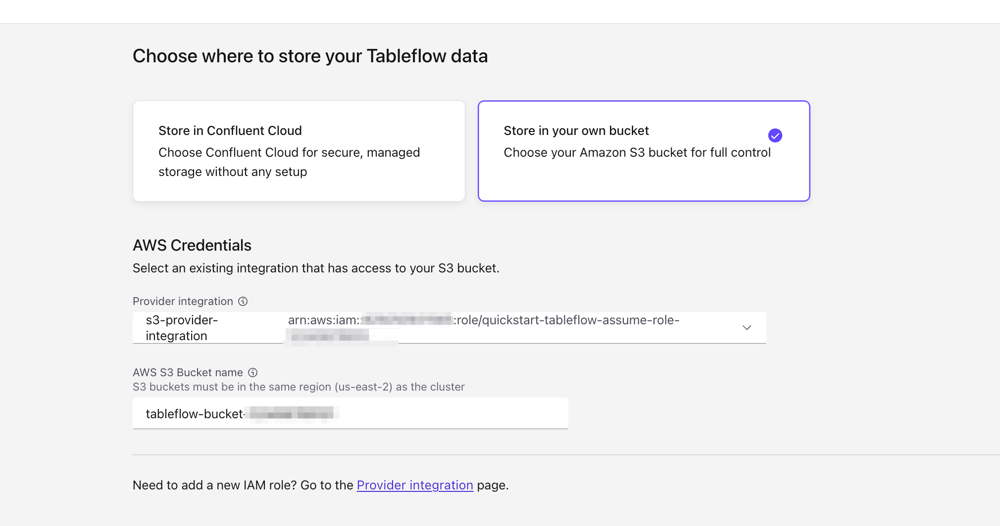

4.  **Launch Tableflow Sync:**
    * Review the configuration details on the final screen.
    * Click **Launch**.

5.  **Monitor Status:**
    * Back on the Topics page, you will see the status for that topic change under the Tableflow column, first to `Tableflow sync pending` and then shortly after to `Syncing`.

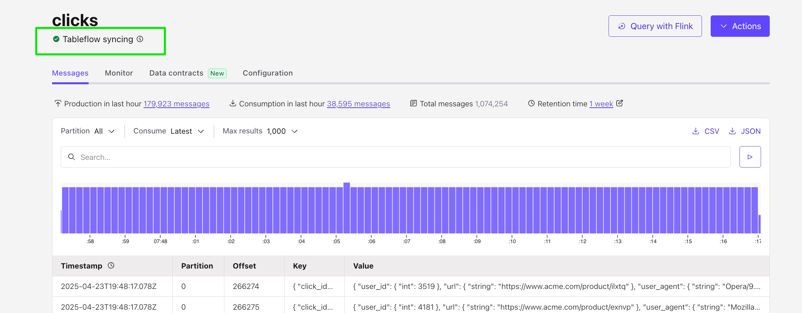

6.  **Repeat for Other Topics:**
    * Repeat steps 2-5 in this section for any other Kafka topics you wish to enable Tableflow on, using the same Provider Integration and S3 bucket.

---

Setup is complete! Tableflow is now configured and actively syncing data from your selected Kafka topics into Iceberg tables within your S3 bucket.


Continue on to [Lab 2](lab2.md) to learn about enabling Glue Data Catalog and querying with Amazon Athena.