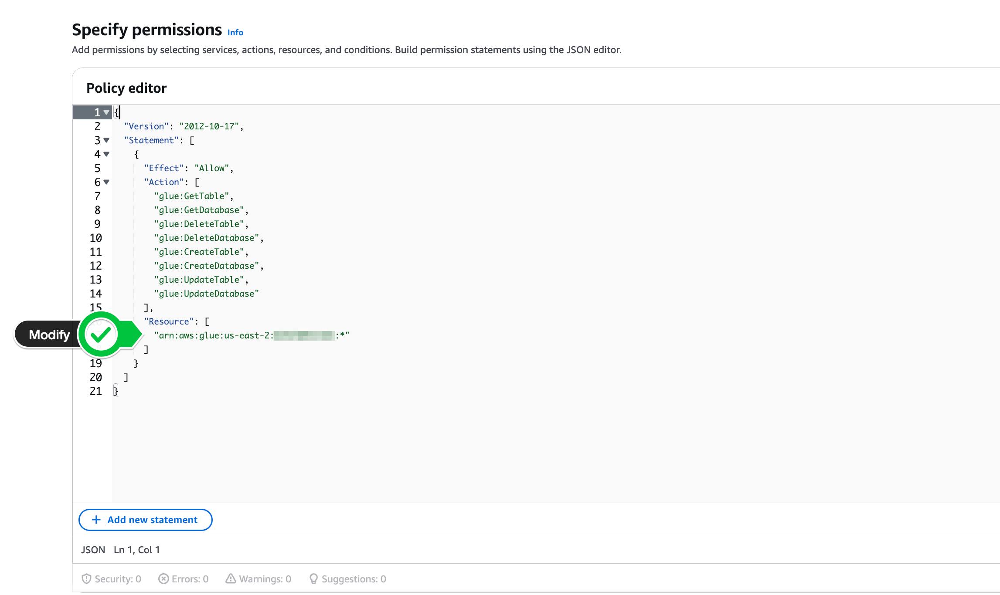

# Lab 2: Integrate Tableflow with AWS Glue Catalog and Query with Athena

This lab guides you through configuring AWS Glue Data Catalog as the external catalog for your Tableflow setup, and then querying the resulting Iceberg tables using AWS Athena. This involves first creating a dedicated Provider Integration for Glue access, then setting up the Catalog Integration itself, and finally querying via Athena.

**Prerequisites:**

* You have completed **Lab 1: Configure AWS and Enable Tableflow**, meaning:
    * You have an S3 bucket configured.
    * You have a Provider Integration set up for S3 storage (`s3-provider-integration`) using an IAM role (`quickstart-tableflow-assume-role`).
    * Tableflow is enabled and syncing for one or more Kafka topics to your S3 bucket.
* Access to an AWS account with permissions to manage AWS Glue Data Catalog, AWS Athena, and create IAM policies and roles.
* Appropriate IAM permissions set up for Athena to query data in S3 and access the Glue Data Catalog.

---

## Step 1: Navigate to Provider Integrations

1.  In your **Confluent Cloud** console, navigate to your Cluster: Environment > Your Environment > Your Cluster
2.  Click on **Tableflow** in the left-hand menu.
3.  Click on ** View provider Integrations**.

    


---

## Step 2: Start Creating the *New* Provider Integration for Glue

**Important:** This creates a *separate* IAM Role and Provider Integration specifically for allowing Confluent Cloud to interact with your AWS Glue Data Catalog. It is *different* from the `s3-provider-integration` role used for writing data to S3.

1.  In the Provider Integrations section, click **+ Add Integration**.
2.  Choose to **create a new role** when prompted and click **Continue**.
3.  On the "Create Permission Policy in AWS" screen, ensure the Confluent Resource selected is **Tableflow Glue Catalog sync** (or similar wording indicating Glue access, *not* S3 access).
4.  **IMPORTANT:** Confluent Cloud will display a JSON permissions policy specifically for Glue access. **Copy this `permissions-policy.json`**. You will need it in the next step. Keep this Confluent Cloud wizard page open.


---

## Step 3: Create AWS IAM Policy for Glue Access

Use the policy JSON copied from the *Glue* wizard step to create an IAM policy in AWS.

1.  In your **AWS Management Console**, navigate to the **IAM** service.
2.  Click **Policies** -> **Create Policy**.
3.  Select the **JSON** tab.
4.  Paste the `permissions-policy.json` you copied in the previous step (specific to Glue access). *This policy grants permissions like `glue:GetDatabase`, `glue:CreateTable`, `glue:UpdateTable`, etc.*
5. Ensure you modify the Resource block to input your region (e.g. `us-east-2`) and account number.




6.  Click **Next** (or Next: Tags -> Next: Review).
7.  Give the policy a descriptive **Name**, like `tableflow-glue-access-policy`.
8.  Click **Create Policy**.
9.  Return to the **Confluent Cloud** provider integration wizard and click **Continue**.

---

## Step 4: Create AWS IAM Role for Glue Access (Initial)

Create a new IAM role in AWS that Confluent Cloud will assume *specifically for Glue access*.

1.  The Confluent Cloud wizard (for the Glue Provider Integration) should now display a **`trust-policy.json`** on the "Create role in AWS and map to Confluent" page. **Copy this `trust-policy.json`**. Keep the wizard open.
2.  In **AWS IAM**, navigate to **Roles** -> **Create role**.
3.  Select **Custom trust policy**.
4.  Paste the `trust-policy.json` you copied from the *Glue* Provider Integration wizard into the JSON editor.
5.  Click **Next**.
6.  On the **Add permissions** page, search for and select the IAM policy you created specifically for Glue access in Step 3 (e.g., `tableflow-glue-access-policy`).
7.  Click **Next**.
8.  Enter a **Role name** (distinct from your S3 role), e.g., `quickstart-tableflow-glue-assume-role`.
9.  Scroll down and click **Create role**.
10. After the role is created, view the role details and **copy its ARN**.


---

## Step 5: Complete Glue Provider Integration (Confluent & AWS)

Link the new Glue IAM role back to Confluent Cloud within the Provider Integration wizard.

1.  Return to the **Confluent Cloud** wizard for the Glue Provider Integration.
2.  Paste the **AWS Role ARN** for the *Glue access role* (copied in the previous step) into the appropriate field.
3.  Give this Glue-specific **Provider Integration** a **Name** (e.g., `glue-provider-integration`). Make a note of this name.
4.  Click **Continue**.
5.  **IMPORTANT:** Confluent Cloud will display an **updated Trust Policy JSON** (with the External ID) for the *Glue access role*. **Copy this entire updated `trust-policy.json`**.
6.  Go back to the **AWS IAM Role** you created specifically for Glue access (e.g., `quickstart-tableflow-glue-assume-role`).
7.  Select the **Trust relationships** tab and click **Edit trust policy**.
8.  **Replace the entire existing JSON** with the updated `trust-policy.json` (containing the External ID) you copied from Confluent Cloud.
9.  Click **Update policy**.
10. Return to the **Confluent Cloud** wizard and click **Continue** (or Finish/Create) to complete the Glue Provider Integration setup. You should now see `glue-provider-integration` listed in your Provider Integrations.

---

## Step 6: Create Catalog Integration

Now, create the Catalog Integration and link it to the Glue Provider Integration you just finished setting up.

1.  In your **Confluent Cloud** console, navigate to your Environment -> **Tableflow**.
2.  Scroll down to the **External Catalog Integration** section.
3.  Click **+ Add Integration**.
4.  For the integration type, select **AWS Glue** as the catalog.
5.  Provide a **Name** for this catalog integration instance, for example, `my-glue-catalog-integration`.
6.  In the section asking for the provider integration, **select the existing Glue Provider Integration** you created in the previous steps (e.g., `glue-provider-integration`) from the dropdown or list.
7.  Review the overall configuration for the AWS Glue Catalog Integration.
8.  Click **Launch** (or Continue/Create).

---

## Step 7: Verification (Glue Catalog)

1.  Monitor the status of the **Catalog Integration** (`my-glue-catalog-integration`) in the Confluent Cloud Tableflow UI. It should transition to **Connected** or **Running**.
2.  Navigate to the **AWS Glue Data Catalog** service in your AWS Console.
3.  Look for a new **Database** named after your Confluent Cloud Kafka Cluster ID (e.g., `lkc-xxxxxx`).
4.  Inside that database, you should start seeing **Tables** appearing with names corresponding to the Kafka topics you enabled Tableflow for in Lab 1 (e.g., `clicks`, `orders`).
5.  It might take a few minutes for the initial sync and table creation to occur.

---

## Step 8: Query Iceberg Tables with AWS Athena

Once the tables appear in AWS Glue, you can query them using Athena.

1.  **Navigate to Athena:**
    * In your **AWS Management Console**, navigate to the **Amazon Athena** service.
    * Ensure you are in the correct AWS region.

2.  **Configure Query Editor:**
    * In the Athena query editor, verify your **Workgroup** settings (the default `primary` workgroup is often sufficient, but ensure it has an S3 query result location configured).
    * For **Data source**, select **AwsDataCatalog**. This tells Athena to use your Glue Data Catalog.
    * For **Database**, select the database name that corresponds to your Kafka Cluster ID (e.g., `lkc-xxxxxx`), which you verified in Step 7.


3.  **Run Queries:**
    * You can now run standard SQL queries against the tables registered in Glue. The table names will typically match your Kafka topic names.
    * **Example Queries:** Replace `<<logical-cluster-id>>` with the actual Glue database name and `<<topic-name>>` with the actual Glue table name (e.g., `clicks`, `orders`).

        ```sql
        -- See the first 10 records from a table
        SELECT *
        FROM "<<logical-cluster-id>>"."<<topic-name>>"
        LIMIT 10;

        -- Count the total number of records (will increase as Tableflow syncs)
        SELECT COUNT(*)
        FROM "<<logical-cluster-id>>"."<<topic-name>>";

        -- Example: Count records for a specific condition (if applicable to your schema)
        -- SELECT COUNT(*) as price_greater_than_50 
        -- FROM "<<logical-cluster-id>>"."orders" 
        -- where price > 50.00;
        ```
    * Type your query into the editor and click **Run**.

4.  **Analyze Results:**
    * The query results will appear in the **Results** pane below the editor.

**Important Note on Access Control:** As mentioned before, ensure the IAM principal (user or role) running Athena queries has read-only access to the Glue Data Catalog resources (database, tables) and the underlying S3 data location (`s3:GetObject` on `s3://<<Your S3 Bucket Name>>/*`). Avoid granting write permissions via Athena to data managed by Tableflow.

---

You have now successfully integrated Tableflow with your AWS Glue Data Catalog using a separate Provider Integration and queried the automatically created Iceberg tables using AWS Athena.


--- 

# If you don't need your infrastructure anymore, do not forget to delete the resources!

---

## Empty and Delete the Amazon S3 Bucket

If you no longer need the S3 bucket created during **Lab 1**, follow these steps to empty and delete it:

1. **Empty the Bucket:**
    - Navigate to the **Amazon S3** service in your AWS Management Console.
    - Locate the bucket you created for Tableflow (e.g., `your-tableflow-bucket-name`).
    - Click on the bucket name to open it.
    - Select all objects and folders within the bucket.
    - Click **Delete** and confirm the deletion.

2. **Delete the Bucket:**
    - Return to the **Amazon S3** service.
    - Select the bucket you just emptied.
    - Click **Delete**.
    - Confirm the bucket name and click **Delete bucket**.

**Important:** Ensure that no other services or applications are using this bucket before deleting it.

----


## Delete IAM Policies and Roles

If you no longer need the IAM policies and roles created during **Lab 1** and **Lab 2**, follow these steps to delete them:

### Delete IAM Policies

1. **Navigate to the IAM Policies:**
    - In your **AWS Management Console**, go to the **IAM** service.
    - Click on **Policies** in the left-hand menu.

2. **Locate and Delete Policies:**
    - Search for the policies you created, such as:
        - `tableflow-s3-access-policy` (created in Lab 1)
        - `tableflow-glue-access-policy` (created in Lab 2)
    - Select each policy and click **Delete**.
    - Confirm the deletion.

**Note:** Ensure that no other roles or users are attached to these policies before deleting them.

---

### Delete IAM Roles

1. **Navigate to the IAM Roles:**
    - In your **AWS Management Console**, go to the **IAM** service.
    - Click on **Roles** in the left-hand menu.

2. **Locate and Delete Roles:**
    - Search for the roles you created, such as:
        - `quickstart-tableflow-assume-role` (created in Lab 1)
        - `quickstart-tableflow-glue-assume-role` (created in Lab 2)
    - Select each role and click **Delete role**.
    - Confirm the deletion.

**Important:** Ensure that these roles are no longer in use by any services or applications before deleting them.

---

By completing these steps, you will have successfully cleaned up the IAM policies and roles created during the labs.
---
Go to [destroy lab](../README.md#tear-down) to delete your Confluent infrastructure as well.x
